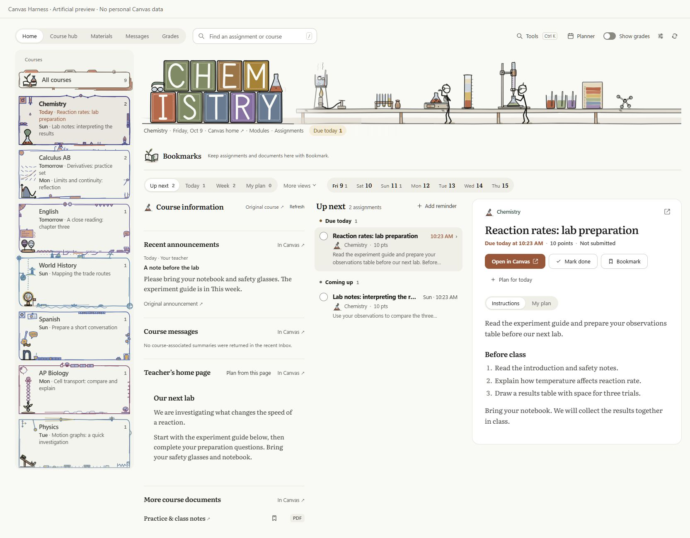
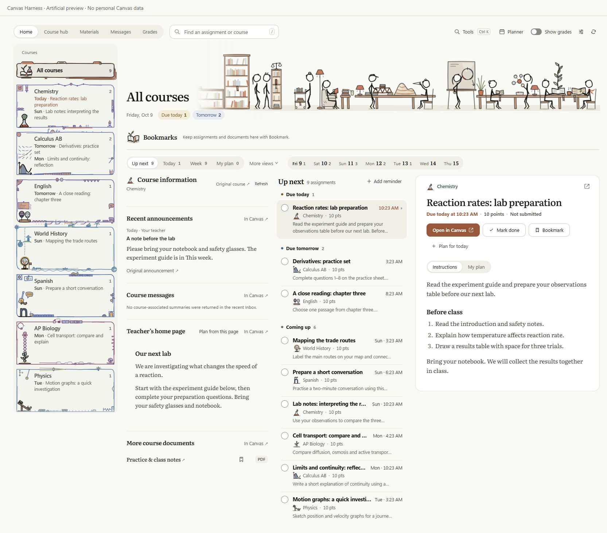

# Canvas Harness

A Canvas companion that brings course information, upcoming work, assignment instructions, bookmarks, grades and study tools together in one organized workspace.

Animated subject artwork makes each course easy to recognize. Course information, upcoming assignments and instructions sit side by side, with room for the next homework directly in the course sidebar. Course names and content come from your own signed-in Canvas account.



## Artwork that follows your subjects

Canvas Harness automatically matches course names and familiar course codes to 22 coordinated sets of animated banners, icons and hand-drawn borders. Algebra, geometry, precalculus, calculus, biology, chemistry, physics, English, writing, reading, languages and history each have their own drawings, including AP science and Calculus AB/BC variants.

Individual course cards have space for homework previews. **All courses** stays compact and keeps its general artwork; unmatched subjects use the same general drawing. Your uploaded artwork always takes priority. Personal course names are preserved, and illustrated title lettering appears only when it matches the course's displayed name.



## Make it yours

Open **Customize workspace** in the dashboard toolbar. Settings slides in from the right while the main page stays usable. Changes save locally and appear immediately.

- Upload or paste animated SVG banners, icons and borders for individual courses and All courses. Download starter SVG templates or restore the built-in drawings.
- Choose a sidebar or horizontal course strip; put course information or assignments first, or stack the workspace. Studio, Study and Focus presets provide starting points.
- Rename, recolor, reorder and hide courses without changing Canvas itself.
- Choose paper, clean or high-contrast surfaces, hand-drawn/rounded/minimal borders, banner size and positioning, spacing, typography, accent, theme and motion.
- Show or hide course icons, deadline previews, bookmarks, course information and recent scored work. Grades have a separate visibility switch.

Artwork is rendered as isolated images. Self-contained CSS and SMIL animation are supported; scripts, external resources and complex editor-specific SVG features are rejected. The upload limit is 256 KiB per file and 2 MiB total. Reduced motion and the animation-off controls use static artwork.

Settings and artwork are included in your account-specific personal backup. Appearance resets keep your notes, plans and bookmarks.

### Draw your own artwork with an AI assistant

[`skills/canvas-harness-art`](skills/canvas-harness-art/) teaches an AI assistant to draw a course's banner (with the course name lettered into it), icon and border in the same hand-drawn, animated style, as SVG files the uploader accepts.

- With an assistant that loads skills, copy the folder into your skills directory. With any other assistant, paste [`PROMPT.md`](skills/canvas-harness-art/PROMPT.md) into the chat.
- Tell it what your course actually does this term and your course color. It returns three SVG files to upload under **Customize workspace**.
- `node skills/canvas-harness-art/scripts/check.cjs <folder>` runs the uploader's own checks on the files and writes a preview page that shows them at the sizes Canvas Harness uses.

The skill is not part of the install ZIP.

## AI beside your work

**Tools → AI** brings selected assignment instructions and course documents into your preferred AI chat. Open ChatGPT, Claude or Gemini, or choose another provider under More. Review the sources and use **Inject context** to append them to the website's draft without sending it. For an opened assignment, its instructions start selected; Home lets you choose.

Small PDFs are read locally. Missing or shortened text is shown before sharing. Optional **Connected chat** uses the official Sign in with ChatGPT flow through CH's local companion and attaches selected context when you press Send. Setup, supported providers and privacy details are in [Study with AI](AI.md).

## GPA your way

**Tools → GPA** estimates unweighted grades on 4.0 and 4.3 scales side by side. Adjust course credits, grade cutoffs and points, weighting bonuses, caps and included courses. Try what-if grades without changing Canvas. Missing grades are excluded, and revealing GPA in the dock leaves the main grade visibility switch unchanged. These are customizable estimates, not official transcript calculations.

## Install

Download **Canvas-Harness-2.20.0.zip** from [Releases](https://github.com/Flzsh/canvas-harness/releases/latest), extract it, and load the extracted folder containing `manifest.json` from Chrome or Edge's Extensions page with Developer mode enabled. See [INSTALL.md](INSTALL.md) for the full instructions.

If you download the GitHub source ZIP instead, load its **extension** subfolder. Keep the extracted folder in place after installation.

## Supported sites

- HTTPS school Canvas sites on `*.instructure.com`.
- The popup detects the active Canvas tab, or accepts your school's Canvas URL.
- Custom Canvas domains and self-hosted deployments need additional support.
- School permissions and API settings vary. Compatibility has been checked with automated tests and artificial preview data; live accounts at other schools have not yet been verified.

## Privacy

Canvas requests are read-only and stay on the current school origin. Local plans, bookmarks and checked-off homework are separated by school origin and Canvas account. Grades are hidden by default. Marking homework done does not submit it to Canvas or change a grade.

The download contains application files, not account caches, grades, enrolment lists, teacher messages, private notes or personal backups. Do not share an exported personal backup when distributing the extension. The preview and tests use artificial accounts and courses.

Desmos is an external calculator loaded when opened. Canvas Harness does not pass Canvas account or course data to it.

## Development

Node.js 22 or newer. No package installation is required.

```sh
npm test
npm run check
npm run build
npm run preview
```

The build writes an extension ZIP, a separate optional AI companion ZIP and a SHA-256 manifest to `dist/`. The artificial preview is excluded from the install ZIP and serves only the extension and preview directories on localhost.

## License

Canvas Harness is licensed under the [MIT License](LICENSE). Copyright (c) 2026 Flzsh.

See [NOTICE.txt](extension/NOTICE.txt) for attribution. Bundled Literata fonts remain licensed under the [SIL Open Font License 1.1](extension/fonts/OFL.txt).
