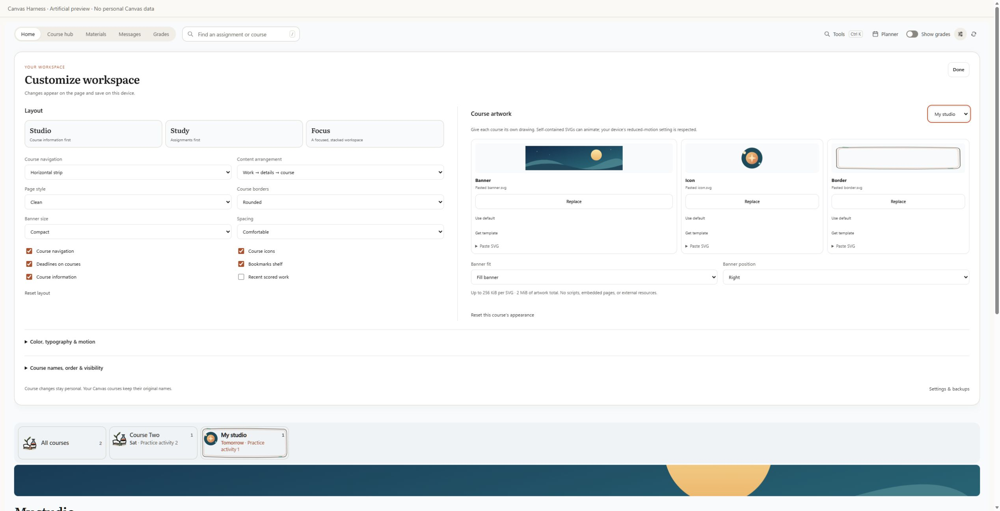

# Canvas Harness

A Canvas companion that brings course information, upcoming work, assignment instructions, bookmarks, grades and study tools together in one organized workspace.

Customize the layout, artwork, colors and course navigation around the way you work. Course names and content come from your own signed-in Canvas account.



## Make it yours

Open **Customize workspace** in the dashboard toolbar. Changes save locally and appear immediately.

- Upload or paste animated SVG banners, icons and borders for individual courses and All courses. Download starter SVG templates or restore the built-in drawings.
- Choose a sidebar or horizontal course strip; put course information or assignments first, or stack the workspace. Studio, Study and Focus presets provide starting points.
- Rename, recolor, reorder and hide courses without changing Canvas itself.
- Choose paper, clean or high-contrast surfaces, hand-drawn/rounded/minimal borders, banner size and positioning, spacing, typography, accent, theme and motion.
- Show or hide course icons, deadline previews, bookmarks, course information and recent scored work. Grades have a separate visibility switch.

Artwork is rendered as isolated images. Self-contained CSS and SMIL animation are supported; scripts, external resources and complex editor-specific SVG features are rejected. The upload limit is 256 KiB per file and 2 MiB total. Reduced motion and the animation-off controls use static artwork.

Settings and artwork are included in your account-specific personal backup. Appearance resets keep your notes, plans and bookmarks.

## Install

Download **Canvas-Harness-2.18.1.zip** from [Releases](https://github.com/Flzsh/canvas-harness/releases/latest), extract it, and load the extracted folder containing `manifest.json` from Chrome or Edge's Extensions page with Developer mode enabled. See [INSTALL.md](INSTALL.md) for the full instructions.

If you download the GitHub source ZIP instead, load its **extension** subfolder. Keep the extracted folder in place after installation.

## Supported sites

- HTTPS school Canvas sites on `*.instructure.com`.
- The popup detects the active Canvas tab, or accepts your school's Canvas URL.
- Custom Canvas domains and self-hosted deployments need additional support.
- School permissions and API settings vary. Compatibility has been checked with automated tests and artificial preview data; live accounts at other schools have not yet been verified.

## Privacy

Canvas requests are read-only and stay on the current school origin. Local plans, bookmarks and checked-off homework are separated by school origin and Canvas account. Grades are hidden by default. Marking homework done does not submit it to Canvas or change a grade.

The download contains application files, not account caches, grades, enrolment lists, teacher messages, private notes or personal backups. Do not share an exported personal backup when distributing the extension. The preview and tests use artificial accounts and courses.

Desmos is an external calculator loaded when opened. Canvas Harness does not pass Canvas account or course data to it.

## Development

Node.js 22 or newer. No package installation is required.

```sh
npm test
npm run check
npm run build
npm run preview
```

The build writes an install ZIP and a SHA-256 manifest to `dist/`. The artificial preview is excluded from the install ZIP and serves only the extension and preview directories on localhost.

## License

Canvas Harness is licensed under the [MIT License](LICENSE). Copyright (c) 2026 Flzsh.

See [NOTICE.txt](extension/NOTICE.txt) for attribution. Bundled Literata fonts remain licensed under the [SIL Open Font License 1.1](extension/fonts/OFL.txt).
